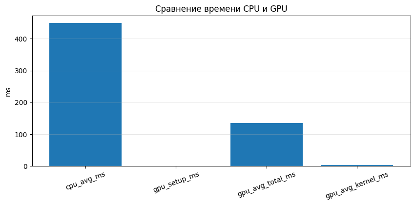
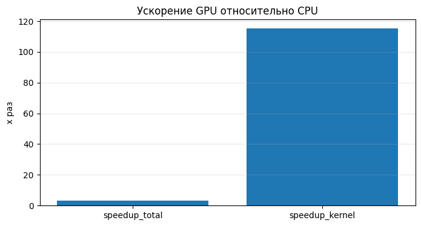
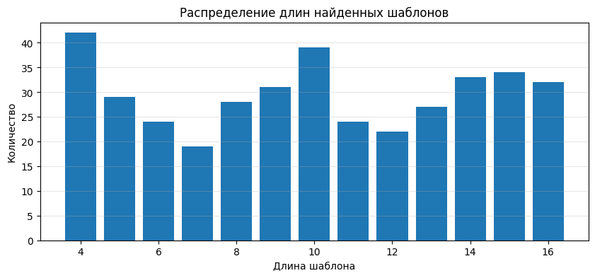
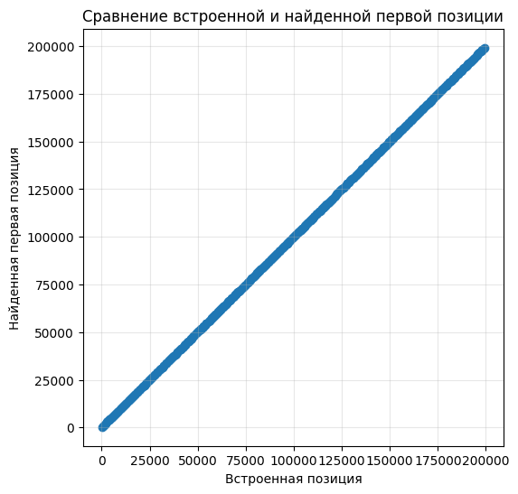

# Лабораторная работа: MassSearch

## Описание работы

В проекте реализован алгоритм массового поиска подстрок в буфере данных с использованием **CUDA**.  
Алгоритм работает на полном восьмибитном алфавите (`|Σ| = 256`) и предназначен для поиска множества шаблонов различной длины в одном входном буфере.

Работа выполнена в **Google Colab** с использованием GPU **NVIDIA Tesla T4**, поскольку у меня нет видеокарты от Nvidia.
В рамках лабораторной были реализованы:

- последовательная **CPU-версия** алгоритма;
- параллельная **GPU-версия** на CUDA;
- автоматическая генерация случайных входных данных;
- сохранение входных данных в файлы;
- сравнение результатов CPU и GPU;
- измерение времени выполнения;
- сохранение результатов в CSV;
- построение таблиц и графиков по результатам экспериментов.

---

## Постановка задачи

Дано:

- буфер поиска `H` длиной `h`;
- множество шаблонов `N` мощностью `|N| = n`;
- длины шаблонов находятся в диапазоне от `minLen` до `maxLen`.

Необходимо определить факт наличия шаблонов в буфере и, при необходимости, найти все позиции их вхождения.

---

## Идея алгоритма

Реализован метод, описанный в задании:

1. Для каждого символа алфавита формируется список всех его вхождений в шаблоны в виде пар `(n, k)`, где:
   - `n` — номер шаблона;
   - `k` — позиция символа внутри шаблона.
2. Формируется рабочая матрица `R` размера `|N| × |H|`.
3. Каждая строка матрицы инициализируется длиной соответствующего шаблона.
4. Для каждого символа входного буфера находятся все соответствующие пары `(n, k)`.
5. Для каждой найденной пары выполняется декремент элемента `R[n, i-k]`.
6. После завершения обработки все нулевые элементы `R[n, j]` соответствуют найденным шаблонам, начинающимся в позиции `j`.

---

## Что именно было распараллелено

Основная идея распараллеливания состоит в том, что **обработка разных позиций входного буфера `H` выполняется независимо**.

### Последовательная CPU-версия

В CPU-версии алгоритм проходит по буферу `H` слева направо:

- берётся символ `H[i]`;
- по таблице предварительной обработки находятся все пары `(n, k)`, соответствующие этому символу;
- для каждой пары обновляется элемент рабочей матрицы `R[n, i-k]`.

Такой вариант корректен, но выполняется последовательно и плохо масштабируется с ростом `h` и `n`.

### Параллельная GPU-версия

В GPU-версии **каждой позиции `i` входного буфера соответствует отдельный CUDA-поток**.

Каждый поток:

1. читает один символ `H[i]`;
2. получает диапазон пар `(n, k)` для этого символа;
3. проходит по этим парам;
4. выполняет декремент соответствующих элементов рабочей матрицы `R[n, i-k]`.

### Почему было распараллелено именно это

Распараллеливание по позициям входного буфера выбрано потому, что:

- количество позиций `h` обычно велико, значит можно загрузить большое число потоков;
- каждая позиция `i` обрабатывается по одной и той же схеме;
- работа с отдельным символом буфера естественно отображается на модель CUDA «один поток — один элемент входа»;
- это позволяет вынести на GPU основную вычислительно затратную часть алгоритма — **основную итерацию по буферу**.

Иными словами, на GPU была распараллелена **главная фаза алгоритма**, которая выполняет наибольшее число однотипных операций.

---

## Почему понадобились атомарные операции

Разные потоки могут обновлять один и тот же элемент матрицы `R`, если разные символы или разные пары `(n, k)` приводят к одной и той же позиции начала шаблона.

Поэтому в CUDA-ядре используется:

```cpp
atomicSub(&R[cell], 1);
```

Это необходимо для корректности параллельного обновления рабочей матрицы и исключения гонок данных.

---

## Что осталось на CPU

На CPU выполняются:

- генерация случайных данных;
- формирование таблиц предварительной обработки;
- запуск и измерение CPU-версии;
- выделение памяти и подготовка данных для GPU;
- интерпретация матрицы `R` после завершения вычислений;
- построение таблиц и графиков по результатам.

Такое разделение логично, потому что именно основная итерация по буферу является самой трудоёмкой частью и даёт наибольший эффект от переноса на GPU.

---

## Особенности 

- реализованы **CPU**- и **GPU**-версии алгоритма;
- для GPU используется CUDA kernel с `atomicSub`;
- таблица `occOffsets` копируется в **constant memory**;
- измеряются:
  - среднее время CPU;
  - среднее полное время GPU;
  - среднее время выполнения только CUDA kernel;
- результаты CPU и GPU автоматически сравниваются;
- входные данные могут сохраняться в файлы;
- результаты экспериментов сохраняются в `metrics.csv` и `found_patterns.csv`.

---

## Используемые технологии

- C++
- CUDA
- Google Colab
- nvcc4jupyter
- Python
- pandas
- matplotlib

---

## Ссылка на Google Colab

Ноутбук с полной реализацией и всеми ячейками для компиляции доступен по ссылке:

[Открыть notebook в Google Colab](https://colab.research.google.com/drive/1ASGIWoi90kPk1vF97QXqYRMux00iRGWK?usp=sharing)


---

## Основные параметры экспериментов

В программе задаются:

- `h` — длина буфера поиска;
- `n` — число шаблонов;
- `minLen` — минимальная длина шаблона;
- `maxLen` — максимальная длина шаблона;
- `mode` — режим поиска (`PRESENCE_ONLY` или `ALL_POSITIONS`);
- `repeats` — число повторов для усреднения времени;
- `injectMatches` — режим искусственного внедрения шаблонов в буфер.

---

## Проведённые эксперименты

### 1. Проверка корректности на внедрённых шаблонах

Параметры:

- `h = 200000`
- `n = 384`
- `minLen = 4`
- `maxLen = 16`
- `injectMatches = true`

Результат:

- все шаблоны были найдены;
- найденные позиции совпали с позициями внедрения;
- результаты CPU и GPU полностью совпали.

### 2. Случайные данные без внедрения шаблонов

Параметры:

- `h = 200000`
- `n = 384`
- `minLen = 4`
- `maxLen = 16`
- `injectMatches = false`

Результат:

- совпадения не были найдены;
- это ожидаемо из-за крайне малой вероятности случайного совпадения шаблонов длины 4–16 в полном 8-битном алфавите;
- результаты CPU и GPU полностью совпали.

### 3. Случайные данные с короткими шаблонами

Параметры:

- `h = 200000`
- `n = 384`
- `minLen = 2`
- `maxLen = 3`
- `injectMatches = false`

Результат:

- найдено множество случайных совпадений;
- совпадения в основном относятся к шаблонам длины 2;
- результаты CPU и GPU полностью совпали.

Этот эксперимент дополнительно подтверждает корректность реализации, так как при уменьшении длины шаблонов вероятность случайных совпадений закономерно возрастает.

---

## Результаты в виде таблиц

### Таблица 1. Проверка корректности на внедрённых шаблонах

| Параметр | Значение |
|---|---:|
| `h` | 200000 |
| `n` | 384 |
| `minLen` | 4 |
| `maxLen` | 16 |
| `injectMatches` | true |
| CPU average time, ms | 368.833 |
| GPU average total time, ms | 139.336 |
| GPU average kernel time, ms | 3.916 |
| Speedup total | 2.647x |
| Speedup kernel | 94.191x |
| Найдено шаблонов | 384 / 384 |
| Всего вхождений | 384 |
| Совпадение CPU/GPU | полное |

### Таблица 2. Случайные данные без внедрения шаблонов

| Параметр | Значение |
|---|---:|
| `h` | 200000 |
| `n` | 384 |
| `minLen` | 4 |
| `maxLen` | 16 |
| `injectMatches` | false |
| CPU average time, ms | 375.357 |
| GPU average total time, ms | 152.563 |
| GPU average kernel time, ms | 3.926 |
| Speedup total | 2.460x |
| Speedup kernel | 95.613x |
| Найдено шаблонов | 0 / 384 |
| Всего вхождений | 0 |
| Совпадение CPU/GPU | полное |

### Таблица 3. Случайные данные с короткими шаблонами

| Параметр | Значение |
|---|---:|
| `h` | 200000 |
| `n` | 384 |
| `minLen` | 2 |
| `maxLen` | 3 |
| `injectMatches` | false |
| CPU average time, ms | 317.951 |
| GPU average total time, ms | 134.356 |
| GPU average kernel time, ms | 1.072 |
| Speedup total | 2.366x |
| Speedup kernel | 296.543x |
| Найдено шаблонов | 201 / 384 |
| Всего вхождений | 637 |
| Совпадение CPU/GPU | полное |

---

## Графики

Графики для эксперимента 1. Проверка корректности на внедрённых шаблонах:






---

## Интерпретация результатов

Эксперименты показали:

- GPU-реализация корректно воспроизводит результаты CPU-версии;
- основное ускорение достигается в вычислительном CUDA-ядре;
- суммарное ускорение ниже ускорения kernel, поскольку учитывает накладные расходы на инициализацию матрицы и передачу данных;
- для длинных случайных шаблонов совпадения практически отсутствуют;
- при уменьшении длины шаблонов до 2–3 случайные совпадения становятся статистически заметными.

Таким образом, результаты согласуются как с логикой алгоритма, так и с вероятностной оценкой появления случайных совпадений.


